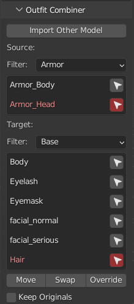
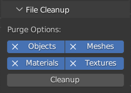

# Nier Character Tools

Small tool set to make modding characters for Nier:Automata in Blender easier.

Current features:
- ~~Quick outfit showing/hiding/focusing~~ (Now part of N2B2N)
- Combining and mixing of outfits
	- Of different outfits in the same model
	- Of outfits from other mods in separate files
- Cleanup of unused objects, meshes, materials, etc.

## Installation

1. You must to have the [N2B](https://github.com/WoefulWolf/NieR2Blender_2_8) and [B2N](https://github.com/WoefulWolf/Blender2NieR) addons installed
2. Click the green "Code" button above and then "Download ZIP"
3. In Blender under Edit > Preferences > Add-ons, click "Install" and select the downloaded zip file

## Usage

All features are in the right panel that you get when pressing the **N** button under "Character Tools".

Also sometimes blender crashes. So save every once in a while.

## Outfit Combining & Mixing

### Importing other files

With "Import Other Model" you can import another .dtt file into the scene. You can then combine the outfits from these models. Make sure to delete the new models with "Delete Other Models" after you are done with them, so that they don't accidentally get exported.

### Combining outfits

You can move, swap and override individual outfit parts. For that you always select a source and target outfit part. You can filter them by the outfits they belong to. For the source you can choose which model should be used if you have more than one in your scene.

You still have to manually configure the textures for the materials in the B2N addon.

## File Cleanup

With this tool you can purge unused objects, meshes, materials, etc. from the .blend file.
